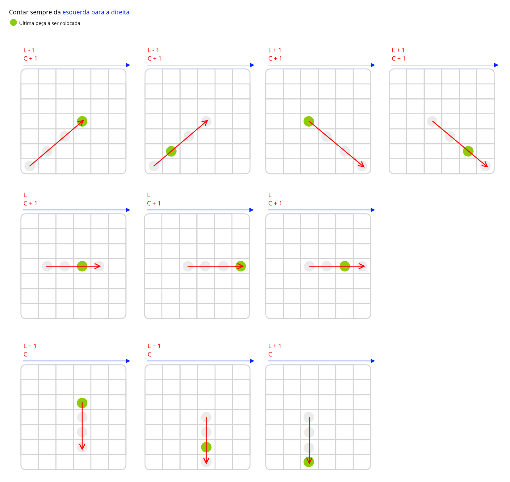

<audio href="https://github.com/alicescfernandes/connect-four/blob/master/assets/music.mp3?raw=true"></audio>
## Projeto final da cadeira de "Matemática Discreta e Programação"

### TOC
- [Introdução](#introdução)
- [Instalação e utilização](#instala%C3%A7%C3%A3outiliza%C3%A7%C3%A3o)
-  Assets

### Introdução
Este jogo foi um trabalho realizado no âmbito da cadeira ["Matemática e Programação Discreta"](https://www.isel.pt/disciplinas/matematica-discreta-e-programacao-leim). Nessa cadeira, para além de ser dada lógica, foi também introduzido o Python, e para consolidar o conhecimento, tivemos de fazer este trabalho em que o tema era mesmo fazer um 4 em linha. Eu quando pensei neste jogo, pensei em algo retro, como aqueles jogos de arcade dos anos 80 e 90, com pixel art e musica 8-bit. Algo deste estilo:

Mas antes de ter o grafismo feito, comecei por desenvolver o motor do jogo, e por isso tive de vir com um algoritmo que desse para detetar as vitorias de todas as direções:

Implementar este algoritmo foi relativamente fácil, e _let's be honest: isto não é nenhuma solução super inovadora_. Outra cena que tive de fazer foi adaptar a área de jogo para a nova grelha (onde se coloca as peças), porque a grelha original ocupa 100% da largura do ecrã,e a minha nova grelha só ocupava um pouco mais de metade.

Só depois de ter o motor feito, desenvolvi os gráficos e integrei no jogo, acabando por ficar assim:

Este trabalho tirou um 16, e para a quantidade de horas que pus em cima disto, acho que foi justo

## Instalação/Utilização
Para jogar isto, descarreguem [aqui](https://github.com/alicescfernandes/connect-four/releases) este jogo, e instalem Python 3.7.0 juntamente com o pygame. Quando tiverem isso feito, basta só executarem o comando `python quatro_em_linha_modo_grafico.py` na linha de comandos.
O jogo só usa o rato, e não dá para mudar/parar a musica no jogo.
